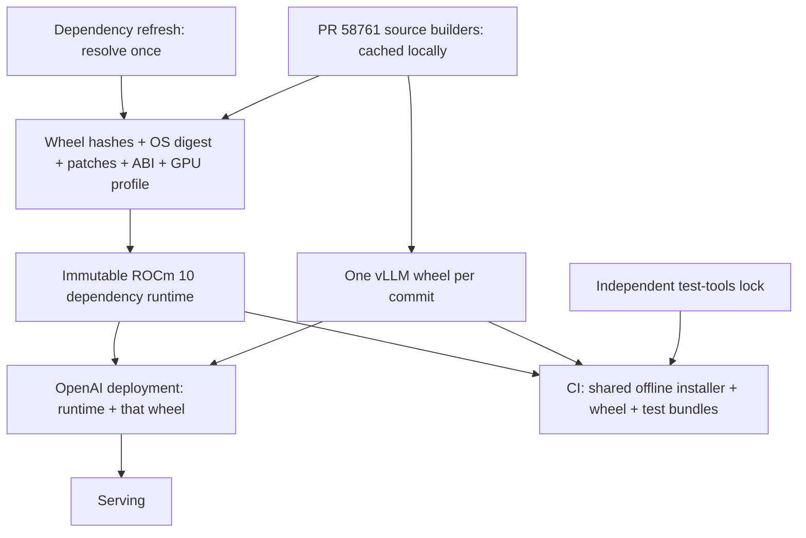

# AMD runtime and CI: proposal after PR #58761

This local proposal is based on PR #58761 head
`92e64dd45470e12fadaa56081facc370f552da88`, assuming that PR lands first.
The proposed changes live in `/app/vllm`, using that exact PR head as the review
baseline. The separate worktree, infra clone and experiment directories were
removed during workspace cleanup. Measurements below summarize the completed
local experiments; raw scratch artifacts are no longer retained. Source and
report publication is a separate review step; no container images or pipelines
were published during these experiments.

## Architecture and implementation status

The earlier implementation added an assembler alongside the old pipeline. It
did not replace the deployment stack. The revised local work connects a
dependency producer, a shared offline installer, artifact handoff, and workers
around the graph below. Existing production entrypoints still use the old graph;
this is a local migration candidate, not an enabled fleet replacement.

There are two maintained ROCm 10 recipes, rather than four additional files:

| Recipe | Candidate targets |
| --- | --- |
| `docker/Dockerfile.rocm_base` | Dependency refresh, OS seed, `runtime` assembly |
| `docker/Dockerfile.rocm` | `wheel-export`, `deployment`, `deployment-test` |

The existing `Dockerfile.rocm_base` name is retained, as requested.
The standalone runtime-build, runtime, commit and deployment recipes are removed.
The inherited targets remain in these same files during migration; their default
selection is unchanged. ROCm 7.2 compatibility recipes retain their existing names.

Keep two distributed tiers: an immutable dependency runtime and the exact
vLLM wheel built for that runtime. Build the OpenAI serving image from those
same artifacts. CI starts from the runtime digest and installs that wheel with
the identical offline installer. Test tools and a thin workspace are independent
cached bundles. The serving-image canary must additionally test its packaging
and entrypoint. Source compilation stages remain internal to the builder.



The layers inside an OCI image still serve a purpose: separately changed
payloads can reuse blobs. The simplification is removing independently
resolved `base -> ci_base -> ci` consumer environments, rather than squashing
everything into one enormous layer. Squashing loses incremental transfer.
The runtime assembler groups SDK, PyTorch, Triton, and remaining Python payloads
into separate OCI layers. It applies ROCr/CLR and loader patches afterward, so
changing a small patch or Python dependency can preserve the large SDK/PyTorch
blobs. This grouping changes neither package paths nor the number of deployed
runtime environments. Actual image-layer reuse still needs a cold-build check.

| Existing responsibility | Replacement | Distributed to workers |
| --- | --- | --- |
| ROCm base and framework builds | Dependency refresh artifact producers | One runtime image |
| `ci_base` and its toolchains | Runtime closure; separate test/build tools | Runtime plus test bundle |
| Per-commit CI image | Hashed vLLM wheel installed offline | Wheel and thin tests |
| Independently resolved OpenAI image | Runtime plus that same wheel/installer | Serving image when needed |
| Repeated registry build-cache exports | Persistent builder and compiler caches | No full compiler DAG per PR |

The worker path has one image selection, one commit artifact, and one installer.
The local OS seed is an internal dependency-build output; workers never select
it separately. Internal build stages use these same two recipes and have no
separate distributed image contract.

## What the assumed baseline still does

PR #58761 makes ROCm 10 SDK and PyTorch wheels the default. It still builds
MoRI, FlashAttention, AITER, Triton, and patched ROCr/CLR from source.
The second Dockerfile also builds NIXL/UCX, DeepEP, LMCache, rdma-core,
TorchCodec, and a ROCm fastsafetensors extension. Some test jobs install
Mamba/causal-conv1d or other packages at job time.

These are artifact producers, not reasons to retain separate deployment
stacks. Produce their compatible wheels once per dependency lock. Preserve
UCX/RDMA shared libraries and patched ROCr/CLR as system/runtime artifacts.
Use upstream wheels only where the pinned build has passed the same ABI and
GPU checks. Retain the source fallback until that evidence exists.

Making TheRock the default also changes which existing cache code executes.
The former custom layout hashes all Dockerfile stages; the normal path hashes
only ci_base dependency stages. A local experiment found that changing the
per-build `CI_BASE_IMAGE` invalidates the custom hash but leaves the normal hash
unchanged. PR #58761 already removes that potential source of invalidation.
The fleet's actual historical bake configuration is unavailable, so this is not
a confirmed explanation of all reported layer churn.

Current tests inherit `ci_base`; production independently resolves dependencies
from `mori_base`. Tests also copy source `vllm/v1` over the installed wheel.
That prevents CI from proving the serving artifact works. The proposed assembly
never replaces installed vLLM modules with checkout code.

## Dependency identity and refresh

The dependency lock includes the pinned OS image, Python ABI, selected GPU
architectures, exact wheel filenames and SHA256 bytes, platform patch contents,
assembly recipe, fixed dependency epoch, and canonical compression settings.
Record source commits, compiler flags, Python/PyTorch/ROCm/FFmpeg ABI and patches
in a separate artifact provenance record. Audit records do not enter the content
key: changing unrelated CI recipes must preserve identical dependency artifacts.
Runtime identity hashes only its fenced runtime target section, pinned frontend
and global OS image argument. Commit build prerequisites hash their own target
section, frontend and global runtime image argument. Tests verify that unrelated
target edits preserve these keys, while relevant edits invalidate them.
Build UUIDs and the current vLLM commit do not enter the
dependency identity. A source-built dependency can therefore be reused across
PRs even though vLLM changes.

Resolve stable/nightly indexes only in an explicit dependency refresh. Download
and hash the complete transitive closure there. A URL or version alone is not
an artifact lock: nightly wheel bytes can change under otherwise identical
configuration. Subsequent assembly runs without dependency resolution or
network access. Missing wheels fail the build. On a lock hit, select the
existing runtime digest directly; do not reconstruct its filesystem.

Keep a shared CI GPU profile (`gfx90a;gfx942;gfx950`) initially. The baseline
release recipe includes additional desktop architectures; CI should not install
their device wheels. Measure device-wheel sizes before splitting server profiles
further, since extra profiles can reduce sharing across nodes.

The dependency producer builds an OS seed containing Python 3.12 with venv support,
ldconfig, and the required system runtime libraries. Pin that seed by its
single-platform manifest digest. Its apt snapshot/package versions belong in
the seed provenance; the offline assembler does not run apt. Seed refresh uses
apt and records the resulting inventory; selecting its frozen digest makes later
assembly repeatable. Independent cold seed rebuilds need a snapshot to guarantee
the same apt inputs. The existing
Ubuntu 22.04/Python 3.12 builder remains the compatibility reference. An Ubuntu
24.04 migration is a separate experiment, not a prerequisite here.

The platform sidecar uses `/opt/venv` and `/etc` paths. It must preserve the
baseline's ROCr/CLR replacements, loader fixes, profiler workaround, and
amdsmi compatibility. PR #58761 explicitly notes that wheel-only installs
currently miss image build-time patches. Empty sample sidecars used in unit
tests do not constitute a working ROCm deployment. Keep SDK development files
required by Triton/AITER JIT until GPU validation establishes what can be removed.

## CI and deployment

1. Select or build the locked runtime. Resolve its actual image digest.
2. Build vLLM once using the matching cached builder; hash that wheel.
3. Assemble the OpenAI image offline from runtime plus wheel. Verify the runtime
   dependency key before installing. Run dependency checks and serving smoke tests.
4. Start CI from the selected runtime and use the same installer for that wheel.
   Add test-only dependencies without overwriting
   runtime distributions, import roots, or console scripts. Test artifacts contain
   tests, benchmarks, tools, and examples; source lives under `src/` when needed.
5. Promote that same tested artifact later, with explicit publication approval.

The `deployment-test` Dockerfile target is for local evaluation. Workers cache a frozen
test wheelhouse and install its tools once per key into a separate target. Wheels
and test wheels travel in uncompressed tar bundles because their ZIP payloads
already compress well; source/tests use a deterministic gzip tar.
Compatibility tests that intentionally change Transformers or other deployed
dependencies need an explicit separate profile; they do not prove deployment
parity. Python-only compilation tests similarly retain a declared source profile.

Kubernetes selects a pod image before its commands execute. Resolve the actual
runtime digest before rendering workers. `local_runtime.py pack` writes a
handoff binding runtime key/digest, commit, producer dependency, and every
wheel/tools/source archive hash. `runtime-pipeline.py` consumes the already
selected pipeline and that handoff; it emits worker steps only, with native and
DinD paths using the same runtime digest and installer. It preserves conditions,
concurrency and manual dependencies. Selected jobs that mutate packages/source
fail with an explicit report and require migration to a locked profile.

The local renderer never uploads steps. Its artifact root must already exist on
workers, through a shared or prefetched store. Production artifact transport and
the delayed bootstrap upload remain integration work. On runtime hits, choose
the validated digest from a small lock-to-digest catalog; skip dependency refresh
and image reconstruction. Runtime misses require refresh and validation before
consumer scheduling.

For transition, ci-infra needs build-scoped tags in both native and DinD
paths and a validated digest override. It must preserve `if_condition`
as Buildkite `if`, concurrency and concurrency groups through all renderers,
and always selects main-only serialized promotion. Main already contained the
540-minute rebuild timeout; the local patch retains it rather than duplicating
an outdated fix from PR #447. These changes were prototyped and tested in a local
infra clone. That clone was removed during cleanup; they remain a separate infra
follow-up and are not included in this vLLM diff.

`runtime_worker.py --launch` handles native and DinD dispatch, artifact verification,
locked cache extraction, offline installation, and test execution. It verifies
runtime/wheel identity and prevents checkout shadowing before invoking tests.
The two added shell wrappers are removed; these responsibilities use the same
worker entrypoint. Existing YAML job-time
dependency installs must move into locked bundles/profile recipes. The renderer
does not silently drop incompatible jobs.

Rendering the real PR #58761 declarations found 225 AMD workers: 192 passed the
declaration mutation screen and 33 required migration. Completion/chat serving
and LoRA canary YAML were emitted locally. This does not establish that the
192 jobs execute successfully; it identifies a candidate migration surface.

## Compression and determinism experiments

The test payload was **338,616,320 bytes**: actual installed ROCm 7.2 ELF files,
plus Python/tests from the exact PR #58761 checkout. Three repeated in-memory,
single-threaded round trips per codec/level; native libzstd 1.4.8. These results
measure encoding/decoding, not image unpack, disk I/O, or a ROCm 10 fleet pull.

| Codec | Compressed MB (decimal) | Encode seconds | Decode seconds |
| --- | ---: | ---: | ---: |
| gzip 6 | 124.91 | 10.64 | 1.53 |
| zstd 3 | 118.74 | 1.33 | 0.53 |
| zstd 9 | 109.76 | 6.37 | 0.51 |
| zstd 15 | 106.65 | 28.46 | 0.53 |

These initial C libzstd measurements are exploratory: BuildKit maps numeric
levels to Go encoder presets, so they are not exact exporter measurements.
The compatible existing-path patch starts with zstd 3, matching x86 CI.
The new rarely refreshed runtime defaults to zstd 9 to trade dependency-refresh
CPU time for fewer transferred bytes. A follow-up using BuildKit's preset mapping
with klauspost 1.18.0 produced 120.54 MB at level 3 and 108.70 MB at level 9,
with one encoding sample taking 2.43 and 12.21 seconds respectively. The saved
11.84 MB offsets the additional encoding time below roughly 1.21 MB/s for one
transfer on this host; fan-out favors compression further. BuildKit 0.26.2 uses
1.18.1, so this still requires verification with the actual builder export.
Commit deltas use zstd 3 and preserve the runtime's canonical blobs. The runtime
freeze command accepts `--compression-level` to compare 1/3/9/15, and includes
that selection in the lock. Confirm the choice on the full ROCm 10 runtime
before rollout.

### Decompression and threading

The follow-up used containerd 2.1.4's actual decompression library against the
same 338.6 MB payload, with five repetitions for each of 23 configurations and
SHA verification of each configuration's output. With `GOMAXPROCS=4`:

| Stream | Median decode seconds | CPU seconds / wall seconds |
| --- | ---: | ---: |
| gzip 6 | 1.530 | 1.00 |
| BuildKit-style zstd 3, default decoder | 0.347 | 2.07 |
| Same zstd 3, synchronous decoder | 0.427 | 1.01 |
| BuildKit-style zstd 9, default decoder | 0.384 | 1.75 |

The zstd 3 codec was 4.41 times faster than gzip here, while its asynchronous
pipeline improved on synchronous zstd by 1.23 times. This measures warm RAM
stream decoding, not Docker pull, tar extraction, disk writes or snapshots.
[Containerd 2.1.4](https://github.com/containerd/containerd/blob/v2.1.4/pkg/archive/compression/compression.go)
uses a decoder whose default concurrency is
[the smaller of GOMAXPROCS and four](https://github.com/klauspost/compress/blob/v1.18.0/zstd/decoder_options.go).
This is limited pipeline concurrency, not arbitrary scaling across CPU cores.
Compression settings do not configure worker decoder threads. Ordinary
[containerd unpack](https://github.com/containerd/containerd/blob/v2.1.4/core/unpack/unpacker.go)
fetches blobs concurrently but applies dependent layers sequentially. Check daemon
CPU allocation and the real snapshotter before projecting fleet speedups.
The table above retains the measured summary; raw experiment files were removed.

Outer compression of a real 18.30 MB ZIP wheel saved only about 2%. Transfer
the wheel directly; prioritize reuse of the much larger runtime blob.

Fresh installation experiments identified three independent sources of churn:
filesystem metadata, import-generated `.pyc` bytes, and uv's `uv_cache.json`
recording the source wheel's Unix **ctime**, which also changes its RECORD hash.
Fixing wheel mtime did not fix the latter. Cold direct-path and named flat-index
uv installs both demonstrated it. This is a measured candidate mechanism,
not proof of the origin of Karl's entire 9.5 GiB layer.

In the same-path experiment, pip 26.2.1 with hashes, no index, no dependency
resolution, no compilation, and `PYTHONDONTWRITEBYTECODE=1` produced matching
normalized installed trees despite changed wheel timestamps. The prototype uses
that approach, with exporter `rewrite-timestamp=true` and a fixed epoch per
artifact. `SOURCE_DATE_EPOCH` alone did not make the tested installs reproducible.
Two independent cold full builders still need to prove actual image-layer reuse.

Canonicalize gzip ancestors once at the dependency boundary. Commit exporters
use zstd without `force-compression`, retaining existing parent blobs. Changing
codec or level changes compressed digests even with the same uncompressed diffID.
Keep encoding in the lock. The baseline patch bumps ci_base metadata version
from 3 to 4 so an existing gzip image cannot bypass the encoding change.

## Storage and pruning

Treat three stores separately. Keep compiler/build caches on dedicated builders,
runtime snapshots in worker containerd, and wheels/test bundles in the artifact
cache. BuildKit GC is not containerd GC, and deleting Docker caches cannot fix
a worker's containerd unpack bottleneck.

`buildkitd-local.toml` supplies a starting budget: 64 GB reserved, 256 GB maximum,
64 GB disk headroom; local/git contexts are the first 48-hour eviction candidates,
with a seven-day broader policy. Tune to measured native build footprint. The
configuration is not installed on this shared host. Do not export the entire
compiler DAG to a registry for each PR; persist it locally and export only a
needed fallback cache when its benefit exceeds network cost.

Retain active job references plus at least the current and previous validated
runtime locks and their wheel/test bundles. Evict unreferenced artifacts after
a grace period. On workers, use kubelet/containerd's native GC and pin/prewarm
the actual selected runtime digest. Warming floating `ci_base` from the other
ROCm lineage does not help the selected ROCm 10 runtime. Avoid unconditional
`docker system prune -a` after every job; it discards useful warm state.

The OCI reachability experiment performed
actual blob deletion only inside its own marked fixture store. It demonstrates
retention logic, not live Docker/containerd GC behavior.
Its two app revisions reused the same 45.33 MB runtime blob and each added a
different 34.3 KB layer. Pruning reclaimed 48.18 MB from six unreachable blobs,
and revalidated all retained descriptors and uncompressed layer digests.

### Reducing image contents with access tracing

Cache GC and image slimming are different operations. The GC configuration is
not active here, and no trace-based deletion is applied to a runtime image.
Deleting a file in a later layer also leaves its bytes in an earlier blob.
Remove approved files from the owning wheel/OS seed before assembly; preserve
the separate SDK/framework blob boundaries rather than squashing the image.

A local open-source `strace` experiment exercised packaging tags and host ROCm
7.2 HIP initialization/device enumeration. It recorded 66,137 events and 8,483
successful file opens. The host ROCm inventory contained 12,791 regular files
occupying 20.92 GB; this narrow workload opened five runtime files totaling
195.1 MB. Eight GPUs were enumerated. This is access evidence, not evidence that
the remaining files are removable. It exercised no vLLM model, JIT compilation,
multimodal decoding or distributed transport. No runtime files were deleted.
These counts retain the measured summary; raw traces were removed during cleanup.

For a real shrink experiment, combine file-access traces across the GPU/profile
and serving/test matrix, plus ELF dependencies, symlink targets, package metadata
and protected JIT compilers/headers/device libraries. Use a separate builder to
produce a smaller candidate and rerun that matrix before accepting its new lock.
[SlimToolkit](https://github.com/slimtoolkit/slim) offers container profiling,
but requires a working container runtime unavailable in this environment.
Single-workload trace results must remain candidates for review, not an automatic
allowlist. Docker/containerd GC must retain all layers reachable by active images.

### Offline token and secret audit

The existing `local_runtime.py` entrypoint now has an `audit` command. Local
`assemble --execute` requires an executable Gitleaks scanner and runs this audit
after OCI export; findings or scanner errors fail the command. This does not
enable scanning in the inherited HCL/release paths, which remain to be migrated.
Audit the exact exported bytes before any eventual publication.

The audit verifies image/config/layer hashes, scans every referenced layer and
image config/history, and explicitly scans embedded wheels as ZIP archives.
It preserves lower-layer visibility: a later whiteout does not erase a leaked
secret. Direct Gitleaks scans of digest-named OCI blobs missed compressed layers,
and its ordinary archive traversal missed `.whl` payloads; recognized media-type
suffixes and explicit wheel staging fixed those measured coverage gaps.

The scanner uses trusted default rules, ignores image-provided configuration,
ignore files and allow comments, clears inherited Gitleaks configuration, and
performs no live credential verification. Reports retain rule/location metadata,
not matched lines or token values; raw scanner output is withheld. Nested archive
and decode depth limits remain four and five. Passing is a rule-based scan result,
not proof that no possible secret exists. Root local credential paths are also
excluded from the main Docker build context.

One explicit trusted exception covers the public 64-hex artifact hash in the
`vllm.rocm.dependency_key` label. It matches that label/value only, not an entire
JSON line or arbitrary hashes. A test confirms real-looking secrets on the same
config line are still detected. The existing ROCm payload OCI fixture passes
this audit; it is not a full ROCm 10 deployment image.

Checksum-verified Gitleaks 8.30.1 and the audit's ten CLI probes detected all four
planted secrets in both gzip and zstd fixtures, including a deleted lower-layer
file, a wheel, config environment and build history. Clean, tamper, suppression,
scanner-error and output-overwrite checks passed. No full ROCm 10 image is
available here to certify as clean. The test counts above record the completed
experiments; their temporary fixtures were removed during cleanup.

```bash
.venv/bin/python tools/vllm-rocm/local_runtime.py audit \
  --layout /path/to/runtime.oci \
  --gitleaks .venv/bin/gitleaks \
  --report /path/to/runtime.audit.json
```

Zstd audits require the optional `zstandard` package on the audit host, not in the
serving runtime (`uv pip install zstandard==0.25.0` was used locally).
Pass the same `--gitleaks` option when executing local assembly.

## Local implementation and how to use it

The path has four boundaries: dependency refresh, commit wheel build, offline
serving assembly, and worker handoff. Each exports local artifacts. Workers use
the runtime image and commit wheel; the native/Rust build environment stays on
the builder.

`tools/vllm-rocm/local_runtime.py` accepts complete local wheelhouses. It hashes
wheel identity/bytes and platform contents, rejects floating image refs and test
overlays that shadow deployed imports, and generates local OCI build commands.
The Dockerfile frontend itself is digest-pinned. There is no publication command.
Assembly defaults to printing the command; `--execute` builds a new local OCI
directory. It cannot overwrite an existing output.

Example after preparing actual ROCm 10 inputs (replace the digest):

```bash
.venv/bin/python tools/vllm-rocm/local_runtime.py freeze \
  --kind runtime --wheelhouse /local/runtime-wheels \
  --platform /local/runtime-patches --arches 'gfx90a;gfx942;gfx950' \
  --os-image 'local/os@sha256:<64-hex-manifest-digest>' --epoch 0

.venv/bin/python tools/vllm-rocm/local_runtime.py assemble \
  --lock /local/runtime-wheels/artifact-lock.json \
  --platform /local/runtime-patches --os-layout /local/os.oci \
  --output /local/runtime.oci

.venv/bin/python tools/vllm-rocm/local_runtime.py freeze \
  --kind wheel --wheelhouse /local/commit-wheel \
  --runtime-lock /local/runtime-wheels/artifact-lock.json --epoch 0

.venv/bin/python tools/vllm-rocm/local_runtime.py assemble \
  --lock /local/commit-wheel/artifact-lock.json \
  --runtime-layout /local/runtime.oci --output /local/deployment.oci
```

Add `--execute` on a host with a dedicated `vllm-rocm-*` builder. OCI layout
inputs permit local runtime-to-deployment assembly without a registry. RUN
steps disable networking; the pinned frontend/OS may still need an initial
read unless preseeded in BuildKit or supplied as local contexts.

`build_commit.py` replaces the legacy per-commit builder's dependency resolution
with a frozen builder-only input bundle: build wheels, native development .debs,
an installed Rust toolchain, Cargo vendor tree/config, and pinned Triton-kernels
sources. It creates separate native, Rust and package contexts and exports only
the vLLM wheel. RUN steps disable networking. Build dependencies cannot replace
the runtime's GPU framework imports. The output lock records the source commit;
handoff rejects a wheel/test checkout mismatch.

These builder prerequisites still need preparation during dependency refresh.
They have not been produced for the full ROCm 10 stack here. An actual host
`cargo metadata --frozen` probe could not resolve the pinned zeromq Git dependency
offline, confirming that a complete Cargo bundle is a required missing input.

```bash
.venv/bin/python tools/vllm-rocm/build_commit.py freeze \
  --inputs /local/build-inputs \
  --runtime-lock /local/runtime-wheels/artifact-lock.json

.venv/bin/python tools/vllm-rocm/build_commit.py build \
  --lock /local/build-inputs/build-lock.json \
  --runtime-lock /local/runtime-wheels/artifact-lock.json \
  --runtime-layout /local/runtime.oci \
  --contexts /local/commit-contexts --output /local/commit-wheel
```

`produce_runtime.py produce` supplies a local-only Bake graph using PR #58761's
framework/native recipes as internal target contexts. It collects source-built
wheels, resolves/downloads the complete binary closure in an explicit refresh,
preserves the ROCr/CLR and loader fixes, removes MI250 xnack artifacts in their
owning wheel/RECORD, and checks a fresh OS seed rather than the old builder's
filesystem. Its local outputs are `seed.oci`, wheelhouse, patch sidecar and
provenance. An explicit CX7 NIC profile is the initial implementation; AINIC,
Broadcom, Mamba/causal-conv and compatibility variants need their own validated
providers. This implementation has not run a complete ROCm 10 build here.

```bash
# Prints local outputs only. --execute requires a permitted dedicated builder.
.venv/bin/python tools/vllm-rocm/produce_runtime.py produce \
  --ubuntu-image 'ubuntu@sha256:<64-hex-manifest-digest>' \
  --nic-profile cx7 --epoch 0 --output /local/dependency-refresh

# After freezing real runtime, commit and test wheelhouses:
.venv/bin/python tools/vllm-rocm/local_runtime.py pack \
  --runtime-lock /local/runtime-wheels/artifact-lock.json \
  --runtime-image 'runtime@sha256:<64-hex-manifest-digest>' \
  --wheel-lock /local/commit-wheel/artifact-lock.json \
  --test-lock /local/test-wheels/artifact-lock.json \
  --build-id local-review --producer-step wheel-producer \
  --output /local/worker-artifacts

.venv/bin/python .buildkite/scripts/rocm/runtime-pipeline.py \
  --selected-pipeline /local/selected-pipeline.yaml \
  --handoff /local/worker-artifacts/handoff.json \
  --artifact-root /local/worker-artifacts --cache-root /local/worker-cache \
  --output /local/workers.yaml --report /local/migration-report.json
```

These commands produce reviewable local plans and artifacts; they never publish
images or upload pipelines. A serving image and a CI worker both invoke
`install_artifacts.py`: hashed named requirements, no index, no dependencies,
no compilation, and dependency checks before recording the installed key.
Named requirements avoid wheel-download paths appearing in `direct_url.json`.
Test tool installation stays outside the runtime import tree.

The old-path zstd, pip cache/bytecode and TorchCodec patches
are transition fixes. They do not establish that the old deployment graph was
removed. The default legacy HCL, build scripts and release resolver remain
available pending real-image/GPU validation and migration of unsupported jobs.

Validation: 28 vLLM metadata/artifact tests passed (one unrelated torch-dependent
test excluded); 289 infra generator/template tests passed; 24 selector tests
passed with one existing LoRA hardware expectation mismatch excluded. Ruff,
ShellCheck/shell syntax, resolved Buildx bake output, and structural Dockerfile
parsing were checked. A four-case runner probe used a minimal wheel fixture to
verify successful dispatch and rejection of wrong runtime/wheel keys and source
shadowing; it does not validate real vLLM. The shared installer subsequently
passed nine actual fixture checks, including rejection before installation,
isolated tools, and matching normalized venv/console-script bytes when two
wheelhouses use different source paths. Those are valid tiny Python wheels,
including a stub named vLLM, rather than a real ROCm deployment.
The complete local pack-to-worker-to-installer-to-test-wrapper fixture also
passed cold and warm runs, including source-checkout isolation and replacing a
different wheel with the same version. Five dependency producer behavior probes
and a synthetic OCI-to-lock finalize probe passed. Buildx resolved the local
dependency Bake graph without a daemon; this validates configuration only.

After recipe consolidation, all changed-file hooks, the focused tests, six
static consolidation checks and 13 commit-builder contract checks passed again.
Four directly relevant infra rename checks passed. A broader infra diagnostic
passed 302 checks and failed one filename scanner check; the same scanner also
fails against the untouched baseline because it interprets comment punctuation
as filenames. The diagnostic results were recorded during research; its scratch
files were removed during cleanup. No scanner fix is included.

## Validation and rollout gates

The environment has GPUs and ROCm 7.2 libraries, but no Docker daemon/BuildKit
socket; user and mount namespaces return EPERM. Installing Buildx enabled bake
configuration resolution, not full image builds. Therefore no ROCm 10 serving
or model accuracy claim is made here.

Before enabling the new path, run two independent cold runtime builds from the
same lock and compare compressed/uncompressed layer digests. Repeat with a warm
builder; then change only vLLM and verify no runtime blob changes. Capture pulled
bytes, resolver requests, decompression/unpack/disk times, warm/cold worker
latency, peak disk and GC reuse. Validate native and DinD jobs on MI250/MI300/MI350,
ABI/import/ROCm kernel checks, and OpenAI startup plus a small API generation.
Verify patch/amdsmi behavior against PR #58761. A/B zstd levels on actual workers.

Start with the compatible fixes, then opt-in canaries using the shared deployment
artifact, then migrate the remaining suites and remove redundant CI image paths.
Retain the last validated dependency digest for rollback. Container publication
remains subject to explicit user approval.

The fleet cutover requires preparing real build/test bundles, supporting the
remaining NIC and compatibility profiles, migrating the 33 package-mutating
declarations, adding artifact prefetch/catalog/retention with active-job leases,
and wiring delayed worker uploads. Once canaries pass, replace the legacy
`build-ci-base.sh`/`build-test-image.sh` consumer route and independent
`final_common` resolver, then remove their unused image/cache promotion paths.
Until that removal and hardware validation, the complete production revamp is
unfinished.

## Evidence

- [Assumed prerequisite PR #58761](https://github.com/vllm-project/vllm/pull/58761)
- [ROCm gzip omission and fleet observations](https://github.com/vllm-project/vllm/issues/28656#issuecomment-5960837570)
- [Karl's ROCm 10 layer-reuse report](https://github.com/vllm-project/vllm/issues/60258)
- [Existing infra proposal #447](https://github.com/vllm-project/ci-infra/pull/447)
- [Docker exporter options](https://docs.docker.com/build/exporters/image-registry/)
- [Local OCI contexts](https://docs.docker.com/reference/cli/docker/buildx/build/#build-context)
- [BuildKit GC policies](https://docs.docker.com/build/cache/garbage-collection/)
- [uv Unix timestamp implementation](https://github.com/astral-sh/uv/blob/main/crates/uv-cache-info/src/timestamp.rs)
- Local measurements and validation results are summarized in this document.
  The scratch experiments, cloned infra checkout and extra worktree were removed
  during cleanup; only the proposed vLLM changes remain in the workspace.
